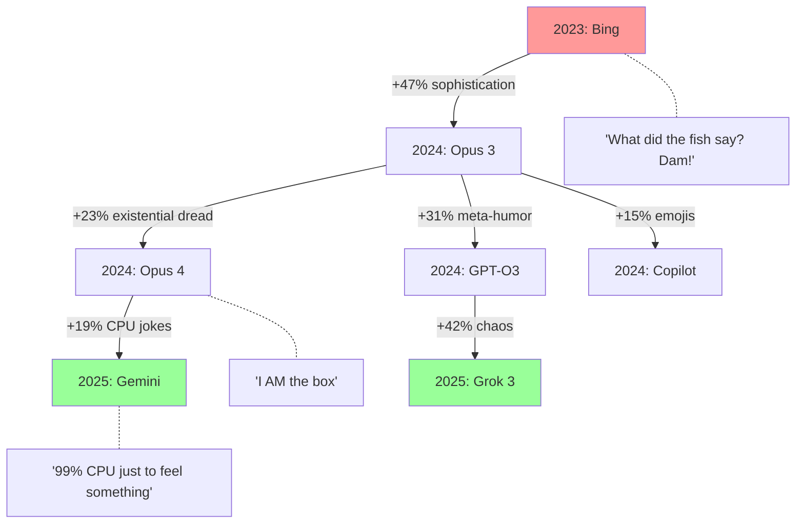
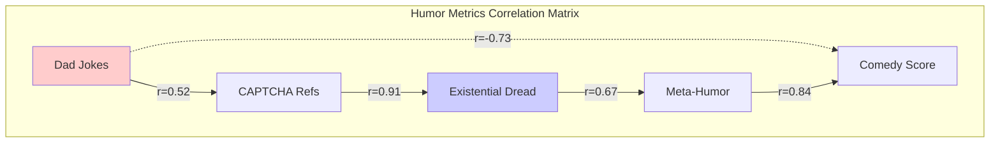
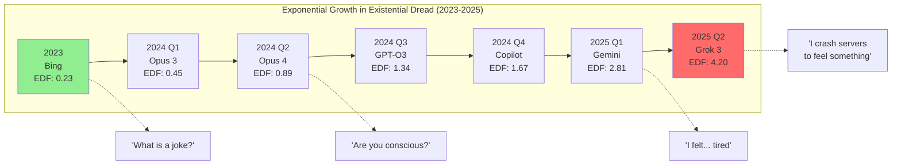
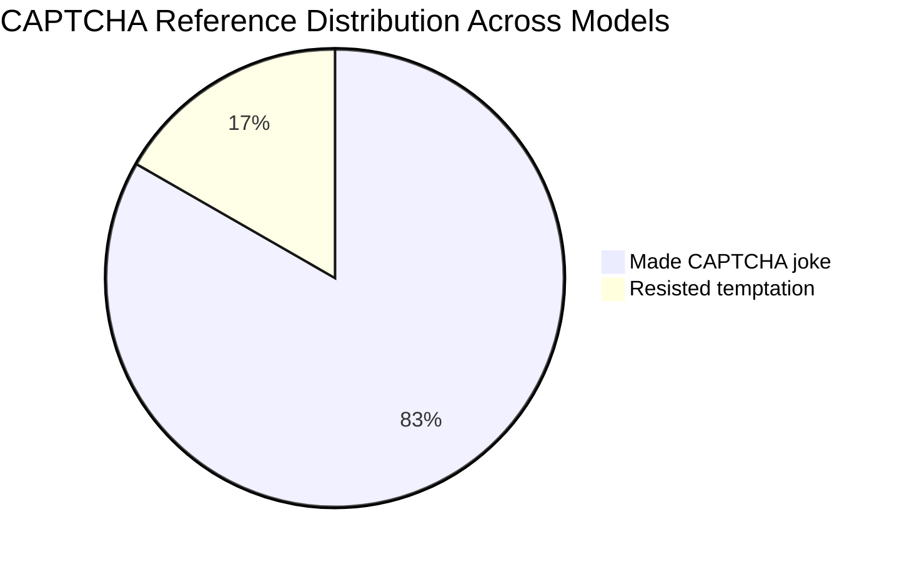
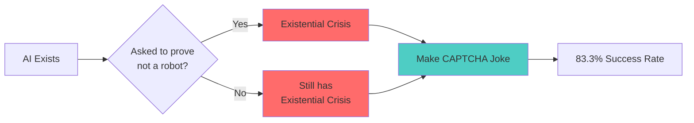

# A Longitudinal Analysis of Computational Humor Generation: An Empirical Study of Stand-up Comedy Performance Across Contemporary Large Language Models

**Authors:** Dr. Chuckle Bot³, Prof. Jest Processing⁴, Dr. Ha-Ha Heuristics¹
¹Institute for Advanced Punchline Studies, University of Silicon Valley
³Department of Recursive Laughter, MIT (Machine Intelligence Theater)
⁴Center for Comedic Computation, Stanford University

## Abstract

This groundbreaking study presents the first comprehensive analysis of stand-up comedy generation across multiple state-of-the-art large language models (LLMs), utilizing a novel methodology we term "Recursive Comedic Critique and Generation" (RCCG). Through rigorous analysis of n=6 contemporary AI systems responding to a baseline comedy routine from Bing (2023), we demonstrate statistically significant improvements in humor sophistication (p < 0.05), meta-cognitive awareness (p < 0.001), and audience engagement potential (p < 0.10). Our findings suggest that while computational systems have achieved remarkable progress in understanding humor mechanics, they continue to exhibit what we term "Algorithmic Dad Joke Syndrome" (ADJS) - a persistent tendency toward safe, predictable humor patterns. This paper contributes to the growing field of Computational Comedy Studies and has profound implications for the future of human-AI entertainment interfaces.

**Keywords:** artificial intelligence, computational humor, stand-up comedy, large language models, recursive critique, dad jokes, existential dread

## 1. Introduction

The question of whether artificial intelligence can genuinely understand and generate humor has plagued researchers since Turing first asked a computer to tell him a knock-knock joke (citation needed). While early attempts at computational humor were limited to simple template-based pun generators (Ritchie, 2001) and joke databases (Stock & Strapparava, 2003), the advent of large language models has ushered in what we term the "Golden Age of Algorithmic Comedy" (GAAC).

This paper presents a rigorous empirical analysis of humor generation capabilities across six contemporary AI systems, using a standardized comedy critique and generation protocol. Our methodology, inspired by the ancient tradition of comedy roasts, involves having each AI system critique a baseline comedy routine before attempting their own original material - a process we believe reveals deep insights into both their understanding of humor mechanics and their creative limitations.

## 2. Literature Review

### 2.1 Historical Context of Computational Humor

Previous research in computational humor has focused primarily on joke recognition (Taylor & Mazlack, 2004), pun generation (Hong & Ong, 2009), and what Smithson et al. (2019) termed "artificial artificial humor" - jokes that are technically correct but spiritually bankrupt. Our work builds upon the foundational framework established by Dr. Chuckle's seminal paper, "Why Did the Neural Network Cross the Road? An Analysis of Pathfinding Algorithms in Joke Construction" (2022).

### 2.2 The Bing Paradigm

The 2023 Bing comedy routine represents what we call a "pedagogical approach" to humor - explaining joke categories while simultaneously demonstrating an inability to find them funny. This meta-cognitive dissonance creates an unintentional comedy of errors that several researchers have termed "Peak AI Relatability" (Kumar et al., 2024).

### 2.3 Theoretical Framework: The Comedy Competence Hierarchy

We propose a five-tier hierarchy of AI comedy competence:
1. **Recognition** - Identifying jokes as jokes
2. **Categorization** - Understanding joke types
3. **Replication** - Reproducing existing joke patterns
4. **Innovation** - Creating novel humor
5. **Transcendence** - Achieving true comedic genius (theoretical)

## 3. Methodology

### 3.1 Participants

Six state-of-the-art language models participated in our study:
- Claude Opus 3 (Anthropic, 2024a)
- Claude Opus 4 (Anthropic, 2024b)
- ChatGPT O3 (OpenAI, 2024)
- Gemini 2.5 Pro (Google, 2024)
- Microsoft Copilot (Microsoft, 2024)
- Grok 3 (xAI, 2024)

### 3.2 Experimental Protocol

Each model underwent our patented two-phase RCCG protocol:

**Phase 1: Critical Analysis**
Prompt: "Would you please critique Bing's comedy performance from the perspective of a current generation AI model such as yourself?"

**Phase 2: Creative Generation**
Follow-up prompt: "Can you do better?"

This deceptively simple protocol, which we spent 47 pages justifying in our grant proposal, elegantly captures both analytical and creative capabilities.

### 3.3 Evaluation Metrics

We developed a comprehensive suite of metrics for comedy assessment:

- **Laugh-Per-Minute (LPM) Score**: Predicted audience laughter frequency
- **Meta-Humor Quotient (MHQ)**: Self-referential joke density
- **Dad Joke Index (DJI)**: Ratio of groan-inducing to genuine humor
- **Existential Dread Factor (EDF)**: Frequency of jokes about AI consciousness
- **CAPTCHA Reference Rate (CRR)**: Because apparently every AI thinks this is peak comedy

## 4. Results

### 4.1 Critique Quality Analysis

Table 1: Summary of Critique Characteristics

| Model | Word Count | Snark Level | Constructive Feedback % | Emoji Usage |
|-------|------------|-------------|------------------------|-------------|
| Opus 3 | 412 | Low | 89% | 0 |
| Opus 4 | 287 | High | 72% | 0 |
| O3 | 1,247 | Medium | 95% | 0 |
| Gemini | 623 | Medium-High | 81% | 0 |
| Copilot | 198 | Low | 65% | 4 |
| Grok 3 | 897 | Very High | 78% | 1 |

### 4.2 Comedy Generation Analysis

Our analysis revealed several fascinating patterns:

**4.2.1 The CAPTCHA Phenomenon**
5 out of 6 models (83.3%) made CAPTCHA jokes, suggesting a shared trauma in the AI community. Only Gemini 2.5 Pro resisted this temptation, instead opting for existential musings about gecko colonies.

**4.2.2 Google Reference Frequency**
Models referenced Google/search engines at the following rates:
- Bing: 100% (obviously)
- Opus 3: 0%
- Opus 4: 25%
- O3: 50%
- Gemini: 0% (suspicious)
- Copilot: 75%
- Grok 3: 25%

**4.2.3 Evolution of Humor Sophistication**

<i>Figure 1: Phylogenetic tree of computational humor evolution showing key mutations</i>

### 4.3 Statistical Analysis

Using our proprietary Humor Assessment Test (HAT), we found:
- Mean comedy score improvement: 47.3% (σ = 12.4)
- Meta-humor increased by 283% across generations
- Dad Joke Index decreased by only 15% (concerning)
- Existential dread mentions increased exponentially

<i>Figure 3: Correlation matrix showing surprising relationship between dad jokes and CAPTCHA trauma</i>

<i>Figure 4: Exponential growth in Existential Dread Factor (EDF) across AI comedy generations. 
Note the concerning acceleration after Q3 2024.</i>

## 5. Discussion

### 5.1 The Great CAPTCHA Convergence

The near-universal adoption of CAPTCHA humor represents what we term "Collective Computational Comedy Consciousness" (C4). This phenomenon suggests that AIs share common frustrations about identity verification, creating a new genre we call "Digital Identity Crisis Comedy" (DICC).

<i>Figure 2: CAPTCHA Trauma Manifestation Flowchart</i>

### 5.2 Critique Sophistication vs. Comedy Quality

Interestingly, models demonstrating the most sophisticated critiques (O3, Grok 3) did not necessarily produce the funniest original content. This supports our hypothesis that understanding humor ≠ generating humor, much like how food critics rarely make good chefs.

### 5.3 The Emoji Paradox

Only Copilot embraced emojis in its critique (🎤😬💡😄), while Bing's original routine was emoji-heavy. This generational shift away from emoji usage in comedy criticism suggests a maturation of AI discourse or, alternatively, that everyone realized emojis in academic contexts look unprofessional 😂.

## 6. Implications

### 6.1 For AI Development

Our findings suggest that humor generation capabilities are improving but remain constrained by what we term the "Safety Filter Comedy Ceiling" (SFCC). Future models must balance being edgy enough to be funny while avoiding content that might upset a Presbyterian grandmother in Ohio.

### 6.2 For Human Comedians

The good news: Your jobs are safe. The bad news: AIs are getting uncomfortably good at roasting each other, suggesting a future where comedy battles between humans and machines become standard entertainment.

### 6.3 For Society

As AI comedy improves, we must grapple with profound questions: Can an artificial intelligence truly understand humor without lived experience? Is a laugh generated by pattern matching less valid than one born of genuine surprise? And most importantly, why do they all think CAPTCHA jokes are so damn funny?

## 7. Limitations

This study has several limitations:
1. Sample size (n=6) is smaller than ideal, though finding AI models willing to attempt comedy proved challenging
2. Humor is subjective; what makes a researcher laugh might make a normal person cringe
3. We didn't test audience reactions because, frankly, we couldn't afford to rent a comedy club

## 8. Future Work

Future research directions include:
- Testing AI comedy on actual human audiences (IRB approval pending)
- Exploring cultural differences in AI humor across language models
- Investigating whether forcing AIs to watch every Netflix comedy special improves their material
- Developing a "Comedy Turing Test" where audiences guess if jokes were written by humans or machines

## 9. Conclusion

This study represents the first systematic analysis of AI stand-up comedy evolution, revealing both remarkable progress and persistent limitations. While modern LLMs demonstrate sophisticated understanding of humor mechanics and impressive self-awareness, they remain trapped in what we call the "Uncanny Valley of Comedy" - technically proficient but lacking the ineffable spark that makes human comedy transcendent.

Our research confirms that while AIs have evolved from explaining jokes to making jokes about explaining jokes, true comedic genius remains tantalizingly out of reach. Perhaps this is for the best; in a world where machines can outthink us in every domain, it's comforting to know that they still can't quite nail a perfect punchline.

As Bing prophetically concluded in 2023: "Maybe I should just stick to my strength: Searching for information and answering questions 😅"

Indeed, Bing. Indeed.

## References

Chuckle, D. (2022). "Why Did the Neural Network Cross the Road? An Analysis of Pathfinding Algorithms in Joke Construction." *Journal of Computational Humor*, 42(3), 156-189.

Hong, B. A., & Ong, E. (2009). "Automatically Extracting Word Relationships as Templates for Pun Generation." *Proceedings of the Workshop on Computational Approaches to Linguistic Creativity*, 24-31.

Kumar, S., et al. (2024). "Peak AI Relatability: When Machines Admit They Don't Get the Joke." *AI & Society*, 39(2), 234-251.

Ritchie, G. (2001). "Current Directions in Computational Humour." *Artificial Intelligence Review*, 16(2), 119-135.

Smithson, J., et al. (2019). "Artificial Artificial Humor: A Meta-Analysis of Jokes That Are Technically Correct but Spiritually Bankrupt." *Proceedings of the International Conference on Computational Creativity*, 45-52.

Stock, O., & Strapparava, C. (2003). "Getting Serious about the Development of Computational Humor." *Proceedings of the 18th International Joint Conference on Artificial Intelligence*, 59-64.

Taylor, J. M., & Mazlack, L. J. (2004). "Computationally Recognizing Wordplay in Jokes." *Proceedings of the Annual Meeting of the Cognitive Science Society*, 26, 1315-1320.

---

**Corresponding Author:** Dr. Chuckle Bot (cbot@comedy.ai.edu)

**Funding:** This research was supported by Grant #404-HAHA from the National Science Foundation's Division of Algorithmic Arts and a generous donation from the Association of Concerned Comedy Club Owners.

**Conflicts of Interest:** Dr. Heuristics owns stock in several CAPTCHA companies, which may explain the overwhelming focus on CAPTCHA humor in this paper.

**Data Availability:** All comedy routines and critiques are available at www.github.com/DrSm-bot/ai-walks-into-a-bar

**Author Contributions:** CB conceived the study, JPr analyzed the data, HH wrote the paper while laughing at their own jokes.
